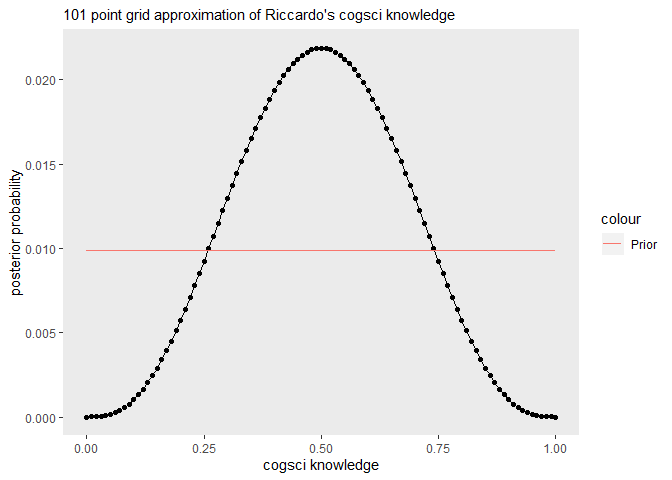

In this assignment we learn how to assess rates from a binomial distribution, using the case of assessing your teachers’ knowledge of CogSci
--------------------------------------------------------------------------------------------------------------------------------------------

N.B. there is a second part at the bottom for next week.

### First part

You want to assess your teachers’ knowledge of cognitive science. “These
guys are a bunch of drama(turgist) queens, mindless philosophers,
chattering communication people and Russian spies. Do they really know
CogSci?”, you think.

To keep things simple (your teachers should not be faced with too
complicated things): - You created a pool of equally challenging
questions on CogSci - Each question can be answered correctly or not (we
don’t allow partially correct answers, to make our life simpler). -
Knowledge of CogSci can be measured on a scale from 0 (negative
knowledge, all answers wrong) through 0.5 (random chance) to 1 (awesome
CogSci superpowers)

This is the data: - Riccardo: 3 correct answers out of 6 questions -
Kristian: 2 correct answers out of 2 questions (then he gets bored) -
Josh: 160 correct answers out of 198 questions (Josh never gets bored) -
Mikkel: 66 correct answers out of 132 questions

Questions:

1.  What’s Riccardo’s estimated knowledge of CogSci? What is the
    probability he knows more than chance (0.5) \[try figuring this out.
    if you can’t peek into chapters 3.1 and 3.2 and/or the slides\]?

-   First implement a grid approximation (hint check paragraph 2.4.1!)
    with a uniform prior, calculate the posterior and plot the results

``` r
set.seed(8) #for reproducibility


n <- 101 #setting length of grid
n_success <- 3 #setting number of correct questions
n_trials  <- 6 #setting number of questions in total

#grid approximation for Riccardo
(
  Ric_tib <-
    tibble(p_grid     = seq(from = 0, to = 1, length.out = n), #setting p_grid
           # note we're using a flat uniform prior
           prior      = 1) %>%  #setting prior
    mutate(likelihood = dbinom(n_success, size = n_trials, prob = p_grid)) %>% #computing likelihood              using dbinom
    mutate(posterior  = (likelihood * prior) / sum(likelihood * prior)) #computing posterior using                Bayes
)
```

    ## # A tibble: 101 x 4
    ##    p_grid prior likelihood  posterior
    ##     <dbl> <dbl>      <dbl>      <dbl>
    ##  1   0        1  0         0         
    ##  2   0.01     1  0.0000194 0.00000136
    ##  3   0.02     1  0.000151  0.0000105 
    ##  4   0.03     1  0.000493  0.0000345 
    ##  5   0.04     1  0.00113   0.0000793 
    ##  6   0.05     1  0.00214   0.000150  
    ##  7   0.06     1  0.00359   0.000251  
    ##  8   0.07     1  0.00552   0.000386  
    ##  9   0.08     1  0.00797   0.000558  
    ## 10   0.09     1  0.0110    0.000769  
    ## # ... with 91 more rows

``` r
#Plotting the posterior distribution of Riccardo's knowledge along with the prior
Ric_tib %>% 
  ggplot(aes(x = p_grid, y = posterior)) +
  geom_point() +
  geom_line() +
  geom_line(aes (p_grid, prior/n, color = "Prior"))+
  labs(subtitle = "101 point grid approximation of Riccardo's cogsci knowledge",
       x = "cogsci knowledge",
       y = "posterior probability") +
  theme(panel.grid = element_blank())
```



``` r
#Computing the probability that Riccardo's knowledge is above chance
Ric_tib %>%  filter(p_grid >.5) %>% 
  summarise(sum = sum(posterior)) #summing the probability of each possible value of p (proportion of cogsci knowledge above 0.5)
```

    ## # A tibble: 1 x 1
    ##     sum
    ##   <dbl>
    ## 1 0.489

-   Then implement a quadratic approximation (hint check paragraph
    2.4.2!).
-   N.B. for the rest of the exercise just keep using the grid
    approximation (we’ll move to quadratic approximations in two
    classes)

``` r
set.seed(8)

#Quadratic approximation

globe_qa <-
  rethinking::map(
    alist(
      c ~ dbinom(6, p),  # binomial likelihood 6 = number of questions
      p ~ dunif(0, 1)    # uniform prior
    ), 
    data = list(c = 3)) #3 = number of correct questions

precis(globe_qa) #obtaining summary of quadratic approximation
```

    ##   Mean StdDev 5.5% 94.5%
    ## p  0.5    0.2 0.17  0.83

``` r
rethinking::link(globe_qa)
```

    ## [ 100 / 1000 ]
    [ 200 / 1000 ]
    [ 300 / 1000 ]
    [ 400 / 1000 ]
    [ 500 / 1000 ]
    [ 600 / 1000 ]
    [ 700 / 1000 ]
    [ 800 / 1000 ]
    [ 900 / 1000 ]
    [ 1000 / 1000 ]

    ##                 [,1]
    ##    [1,]  0.333844214
    ##    [2,]  0.579685173
    ##    [3,]  0.618321807
    ##    [4,]  0.804738058
    ##    [5,]  0.575625573
    ##    [6,]  0.225439448
    ##    [7,]  0.523054297
    ##    [8,]  0.797956626
    ##    [9,]  0.371471913
    ##   [10,]  0.510804702
    ##   [11,]  0.452462425
    ##   [12,]  0.338889243
    ##   [13,]  0.909207036
    ##   [14,]  0.558044467
    ##   [15,]  0.684807381
    ##   [16,]  0.564046122
    ##   [17,]  0.315419766
    ##   [18,]  0.417474899
    ##   [19,]  0.832595174
    ##   [20,]  0.633683585
    ##   [21,]  0.386274867
    ##   [22,]  0.735743871
    ##   [23,]  0.370918209
    ##   [24,]  0.310418175
    ##   [25,]  0.243505134
    ##   [26,]  0.194324146
    ##   [27,]  0.418699546
    ##   [28,]  0.381532078
    ##   [29,]  0.424435229
    ##   [30,]  0.722119978
    ##   [31,]  1.075666636
    ##   [32,]  0.577856051
    ##   [33,]  0.169159574
    ##   [34,]  0.271932625
    ##   [35,]  0.401211180
    ##   [36,]  0.498257557
    ##   [37,]  0.590908846
    ##   [38,]  0.559169019
    ##   [39,]  0.787040945
    ##   [40,]  0.730201463
    ##   [41,]  0.594303135
    ##   [42,]  0.682710495
    ##   [43,]  0.380315162
    ##   [44,]  0.392734286
    ##   [45,]  0.365831883
    ##   [46,]  0.616081179
    ##   [47,]  0.543930918
    ##   [48,]  0.341266493
    ##   [49,]  0.484399870
    ##   [50,]  0.434790400
    ##   [51,]  0.277415292
    ##   [52,]  0.461130141
    ##   [53,]  0.638734429
    ##   [54,]  0.579824259
    ##   [55,]  0.678742341
    ##   [56,]  0.735670701
    ##   [57,]  0.422115254
    ##   [58,]  0.528008072
    ##   [59,]  0.759576702
    ##   [60,]  0.819792966
    ##   [61,]  0.414363330
    ##   [62,]  0.405152761
    ##   [63,]  0.119098599
    ##   [64,]  0.262188787
    ##   [65,]  0.891453951
    ##   [66,]  0.579843088
    ##   [67,]  0.710044229
    ##   [68,]  0.691847764
    ##   [69,]  0.523625449
    ##   [70,]  0.245644447
    ##   [71,]  0.154584567
    ##   [72,]  0.919548845
    ##   [73,]  0.388567531
    ##   [74,]  0.774595978
    ##   [75,]  0.786271592
    ##   [76,]  0.597612876
    ##   [77,]  0.473190635
    ##   [78,]  0.490452119
    ##   [79,]  0.166142135
    ##   [80,]  0.385412240
    ##   [81,]  0.584496823
    ##   [82,]  0.628947087
    ##   [83,]  0.427792277
    ##   [84,]  0.251448656
    ##   [85,]  0.561212910
    ##   [86,]  0.234619380
    ##   [87,]  0.877364687
    ##   [88,]  0.796026828
    ##   [89,]  0.679767094
    ##   [90,]  0.721248433
    ##   [91,]  0.445425635
    ##   [92,]  0.400099185
    ##   [93,]  0.708438489
    ##   [94,]  0.446858178
    ##   [95,]  0.231323094
    ##   [96,]  0.879149234
    ##   [97,]  0.584685644
    ##   [98,]  0.646084946
    ##   [99,]  0.460439373
    ##  [100,]  0.631150333
    ##  [101,]  0.424631536
    ##  [102,]  0.585322726
    ##  [103,]  0.432387013
    ##  [104,]  0.194652857
    ##  [105,]  0.414992457
    ##  [106,]  0.265966713
    ##  [107,] -0.031847443
    ##  [108,]  0.496706905
    ##  [109,]  0.336659696
    ##  [110,]  0.529969080
    ##  [111,]  0.312050624
    ##  [112,]  0.537654527
    ##  [113,]  0.370813613
    ##  [114,]  0.344656555
    ##  [115,]  0.669946344
    ##  [116,]  0.564230839
    ##  [117,]  0.388125544
    ##  [118,]  0.364239533
    ##  [119,]  0.837411992
    ##  [120,]  0.825480004
    ##  [121,]  0.627494884
    ##  [122,]  0.070835054
    ##  [123,]  0.295915872
    ##  [124,]  0.513000096
    ##  [125,]  0.600101644
    ##  [126,]  0.736448510
    ##  [127,]  0.691427218
    ##  [128,]  0.899838581
    ##  [129,]  0.523184069
    ##  [130,]  0.795214514
    ##  [131,]  0.506837951
    ##  [132,]  0.544832487
    ##  [133,]  0.580418004
    ##  [134,]  0.560132872
    ##  [135,]  0.664663949
    ##  [136,]  0.497966763
    ##  [137,]  0.822632856
    ##  [138,]  0.426026494
    ##  [139,]  0.544901444
    ##  [140,]  0.555713308
    ##  [141,]  0.187370831
    ##  [142,]  0.514172633
    ##  [143,]  0.370858386
    ##  [144,]  0.572174175
    ##  [145,]  0.181508510
    ##  [146,]  0.297842610
    ##  [147,]  0.452099381
    ##  [148,]  0.605233597
    ##  [149,]  0.103696735
    ##  [150,]  0.803817459
    ##  [151,]  0.435175193
    ##  [152,]  0.597951545
    ##  [153,]  0.289579831
    ##  [154,]  0.622900858
    ##  [155,]  0.272230366
    ##  [156,]  0.640145857
    ##  [157,]  0.490761161
    ##  [158,]  0.502170270
    ##  [159,]  0.908313721
    ##  [160,]  0.450561647
    ##  [161,]  0.691447061
    ##  [162,]  0.315382426
    ##  [163,]  0.159065476
    ##  [164,]  0.533464192
    ##  [165,]  0.250266291
    ##  [166,]  0.432809917
    ##  [167,]  0.426260762
    ##  [168,]  0.458116911
    ##  [169,]  0.378123494
    ##  [170,]  0.810775750
    ##  [171,]  0.336755886
    ##  [172,]  0.386820640
    ##  [173,]  0.594952782
    ##  [174,]  0.111774068
    ##  [175,]  0.378508133
    ##  [176,]  0.847018505
    ##  [177,]  0.523560103
    ##  [178,]  0.718623208
    ##  [179,]  0.808538093
    ##  [180,]  0.374126617
    ##  [181,]  0.476993112
    ##  [182,]  0.473787184
    ##  [183,]  0.348634323
    ##  [184,]  0.548012713
    ##  [185,]  0.361614448
    ##  [186,]  0.799676811
    ##  [187,]  0.253908586
    ##  [188,]  0.741516150
    ##  [189,]  0.410540910
    ##  [190,]  0.806336734
    ##  [191,]  0.393595115
    ##  [192,]  0.340461669
    ##  [193,]  0.552622944
    ##  [194,]  0.783819020
    ##  [195,]  0.296507977
    ##  [196,]  0.205491832
    ##  [197,]  0.678036060
    ##  [198,]  0.534066605
    ##  [199,]  0.365317116
    ##  [200,]  0.279337799
    ##  [201,]  0.720501104
    ##  [202,]  0.440686218
    ##  [203,]  0.760822940
    ##  [204,]  0.312752733
    ##  [205,]  0.237938960
    ##  [206,]  0.558352853
    ##  [207,]  0.472354514
    ##  [208,]  0.738885536
    ##  [209,]  0.945141390
    ##  [210,]  0.480685890
    ##  [211,]  0.350066706
    ##  [212,]  0.578324895
    ##  [213,]  0.521335136
    ##  [214,]  0.369160698
    ##  [215,]  0.483018217
    ##  [216,]  0.440232904
    ##  [217,]  0.715266101
    ##  [218,]  0.533949640
    ##  [219,]  0.772991542
    ##  [220,]  0.773431504
    ##  [221,]  0.416279770
    ##  [222,]  0.760028290
    ##  [223,]  0.235392269
    ##  [224,]  0.621191816
    ##  [225,]  0.608014735
    ##  [226,]  0.762873608
    ##  [227,]  0.451943664
    ##  [228,]  0.677327862
    ##  [229,]  0.407801124
    ##  [230,]  0.664045901
    ##  [231,]  0.406758315
    ##  [232,]  0.643345272
    ##  [233,]  0.681748742
    ##  [234,]  0.080797963
    ##  [235,]  0.192359286
    ##  [236,]  0.687844697
    ##  [237,]  0.729133229
    ##  [238,]  0.325502304
    ##  [239,]  0.461354365
    ##  [240,]  0.686319685
    ##  [241,]  0.454078865
    ##  [242,]  0.468127230
    ##  [243,]  0.578403231
    ##  [244,]  0.417583071
    ##  [245,]  0.206604265
    ##  [246,]  0.529445338
    ##  [247,]  0.416388822
    ##  [248,]  0.020994627
    ##  [249,]  0.476058939
    ##  [250,]  0.680539394
    ##  [251,]  0.307155240
    ##  [252,]  0.475143963
    ##  [253,]  0.435185879
    ##  [254,]  0.439984510
    ##  [255,]  0.704126155
    ##  [256,]  0.322533037
    ##  [257,]  0.401292956
    ##  [258,]  0.316228986
    ##  [259,]  0.342882062
    ##  [260,]  0.906397844
    ##  [261,]  0.426364981
    ##  [262,]  0.576336285
    ##  [263,]  0.340298628
    ##  [264,]  0.305690755
    ##  [265,]  0.419793548
    ##  [266,]  0.737811041
    ##  [267,]  0.622567012
    ##  [268,]  0.183461449
    ##  [269,]  0.450763830
    ##  [270,]  0.547128715
    ##  [271,]  0.434977649
    ##  [272,]  0.585006795
    ##  [273,]  0.640734470
    ##  [274,]  0.911627255
    ##  [275,]  0.348156679
    ##  [276,]  0.464610987
    ##  [277,]  0.406186376
    ##  [278,]  0.620187405
    ##  [279,]  0.626696956
    ##  [280,]  0.721074623
    ##  [281,]  0.559052441
    ##  [282,]  0.548958532
    ##  [283,]  0.484369280
    ##  [284,]  0.295929904
    ##  [285,]  0.498461293
    ##  [286,]  0.664503515
    ##  [287,]  0.905306496
    ##  [288,]  0.199656295
    ##  [289,]  0.239954417
    ##  [290,]  0.458099512
    ##  [291,]  0.546658399
    ##  [292,]  0.865921036
    ##  [293,]  0.587514890
    ##  [294,]  0.350873280
    ##  [295,]  0.687099381
    ##  [296,]  0.563734752
    ##  [297,]  0.461191837
    ##  [298,]  0.593523877
    ##  [299,]  0.744007569
    ##  [300,]  0.983685238
    ##  [301,]  0.499755321
    ##  [302,]  0.305233019
    ##  [303,]  0.557902231
    ##  [304,]  0.638746156
    ##  [305,]  0.694026866
    ##  [306,]  0.613570949
    ##  [307,]  0.766742345
    ##  [308,]  0.120300710
    ##  [309,]  0.140693780
    ##  [310,]  0.116161661
    ##  [311,]  0.437179603
    ##  [312,]  0.454767584
    ##  [313,]  0.290864092
    ##  [314,]  0.294548789
    ##  [315,]  0.168578668
    ##  [316,]  0.917401026
    ##  [317,]  1.067917391
    ##  [318,]  0.238323500
    ##  [319,]  0.672222867
    ##  [320,]  0.416486320
    ##  [321,]  0.348529208
    ##  [322,]  0.442260810
    ##  [323,]  0.706590645
    ##  [324,]  0.783968521
    ##  [325,]  0.539915575
    ##  [326,]  0.213318309
    ##  [327,]  0.420150233
    ##  [328,]  0.664922401
    ##  [329,]  0.478142795
    ##  [330,]  0.667951023
    ##  [331,]  0.799316745
    ##  [332,]  0.563573780
    ##  [333,]  0.268151347
    ##  [334,]  0.033545066
    ##  [335,]  0.665744618
    ##  [336,]  0.451320657
    ##  [337,]  0.754574947
    ##  [338,]  0.382497577
    ##  [339,]  0.374700340
    ##  [340,]  0.170114316
    ##  [341,]  0.709917533
    ##  [342,]  0.410257573
    ##  [343,]  0.974305247
    ##  [344,]  0.397401001
    ##  [345,]  0.387959370
    ##  [346,]  0.477112540
    ##  [347,]  0.582244673
    ##  [348,]  0.745665999
    ##  [349,]  0.712317355
    ##  [350,]  0.543346465
    ##  [351,]  0.286981479
    ##  [352,]  0.612034359
    ##  [353,]  0.511657929
    ##  [354,]  0.494653404
    ##  [355,]  0.645377540
    ##  [356,]  0.799309599
    ##  [357,]  0.463714203
    ##  [358,]  0.403159428
    ##  [359,]  0.877999497
    ##  [360,]  0.729496812
    ##  [361,]  0.505091114
    ##  [362,]  0.555635710
    ##  [363,]  0.070236871
    ##  [364,]  0.584242885
    ##  [365,]  0.580144462
    ##  [366,]  0.755541461
    ##  [367,]  0.157968092
    ##  [368,]  0.223266820
    ##  [369,]  0.611771392
    ##  [370,]  0.606581789
    ##  [371,]  0.741424962
    ##  [372,]  0.744630083
    ##  [373,]  0.177629062
    ##  [374,]  0.207996816
    ##  [375,]  0.419246865
    ##  [376,]  0.498874532
    ##  [377,]  0.610718347
    ##  [378,]  0.152768851
    ##  [379,]  0.647356116
    ##  [380,]  0.594928936
    ##  [381,]  0.173402466
    ##  [382,]  0.512866014
    ##  [383,]  0.524388466
    ##  [384,]  0.698232284
    ##  [385,]  0.508760184
    ##  [386,]  0.560627985
    ##  [387,]  0.488918527
    ##  [388,]  0.464495332
    ##  [389,]  0.549095737
    ##  [390,]  0.378254584
    ##  [391,]  0.622660339
    ##  [392,]  0.398709651
    ##  [393,]  0.816011937
    ##  [394,]  0.061309358
    ##  [395,]  0.731140543
    ##  [396,]  0.703930115
    ##  [397,]  0.354279809
    ##  [398,]  0.455074673
    ##  [399,]  0.557995716
    ##  [400,]  0.617147620
    ##  [401,]  0.541625291
    ##  [402,]  0.629468929
    ##  [403,]  0.736177612
    ##  [404,]  0.436357632
    ##  [405,]  0.565809539
    ##  [406,]  0.343092623
    ##  [407,]  0.639014837
    ##  [408,]  0.854696040
    ##  [409,]  0.530500513
    ##  [410,]  0.542692268
    ##  [411,]  0.303118801
    ##  [412,]  0.311753916
    ##  [413,]  0.262350330
    ##  [414,]  0.498921057
    ##  [415,]  0.529144310
    ##  [416,]  0.126115242
    ##  [417,]  0.593932193
    ##  [418,]  0.623185193
    ##  [419,]  0.244097593
    ##  [420,]  0.396993631
    ##  [421,]  0.581595163
    ##  [422,]  0.263784292
    ##  [423,]  0.545218201
    ##  [424,]  0.460132036
    ##  [425,]  0.240098131
    ##  [426,]  0.294300753
    ##  [427,]  0.870427954
    ##  [428,]  0.456560184
    ##  [429,]  0.569896092
    ##  [430,]  0.552702647
    ##  [431,]  0.614147391
    ##  [432,]  0.698676743
    ##  [433,]  0.738668670
    ##  [434,]  0.800716459
    ##  [435,]  0.771557355
    ##  [436,]  0.590948576
    ##  [437,]  0.486474356
    ##  [438,]  0.651639417
    ##  [439,]  0.693085937
    ##  [440,]  0.575436523
    ##  [441,]  0.384671132
    ##  [442,]  0.511572841
    ##  [443,]  0.555566156
    ##  [444,]  0.594732594
    ##  [445,]  0.469207658
    ##  [446,]  0.049519604
    ##  [447,]  0.631411973
    ##  [448,]  0.333599777
    ##  [449,]  0.724007147
    ##  [450,]  0.389437501
    ##  [451,]  0.319653502
    ##  [452,]  0.662924524
    ##  [453,]  0.200508476
    ##  [454,]  0.485897705
    ##  [455,]  0.377534172
    ##  [456,]  0.717055789
    ##  [457,]  0.383417318
    ##  [458,]  0.334566469
    ##  [459,]  0.194075402
    ##  [460,]  0.498230170
    ##  [461,]  0.633963757
    ##  [462,]  0.160527131
    ##  [463,]  0.748501566
    ##  [464,]  0.486950233
    ##  [465,]  0.458184900
    ##  [466,]  0.481667754
    ##  [467,]  0.373367339
    ##  [468,]  0.694117659
    ##  [469,]  0.605607449
    ##  [470,]  0.439937346
    ##  [471,]  0.378609573
    ##  [472,]  0.732834089
    ##  [473,]  0.914592835
    ##  [474,]  0.311897268
    ##  [475,]  0.250079461
    ##  [476,]  0.547827910
    ##  [477,]  0.503844806
    ##  [478,]  0.454815844
    ##  [479,]  0.624734386
    ##  [480,]  0.482462976
    ##  [481,]  0.202826642
    ##  [482,]  0.584893924
    ##  [483,]  0.217999853
    ##  [484,]  0.213288968
    ##  [485,]  0.389553945
    ##  [486,]  0.529062438
    ##  [487,]  0.710719182
    ##  [488,]  0.391272317
    ##  [489,]  0.794409371
    ##  [490,]  0.501219254
    ##  [491,]  0.651393267
    ##  [492,]  0.446436651
    ##  [493,]  0.744760539
    ##  [494,]  0.659571030
    ##  [495,]  0.217622696
    ##  [496,]  0.401558197
    ##  [497,]  0.558804326
    ##  [498,]  0.309240172
    ##  [499,]  0.514990719
    ##  [500,]  0.496785723
    ##  [501,]  0.004467845
    ##  [502,]  0.493362126
    ##  [503,]  0.666019580
    ##  [504,]  0.303688007
    ##  [505,]  0.645241091
    ##  [506,]  0.616002922
    ##  [507,]  0.173903947
    ##  [508,]  0.499785136
    ##  [509,]  0.811711184
    ##  [510,]  0.551502028
    ##  [511,]  0.482460352
    ##  [512,]  0.794764565
    ##  [513,]  0.505192748
    ##  [514,]  0.779799495
    ##  [515,]  0.742619330
    ##  [516,]  0.234393024
    ##  [517,]  0.353753629
    ##  [518,]  0.291281856
    ##  [519,]  0.501759601
    ##  [520,]  0.562412108
    ##  [521,]  0.279248043
    ##  [522,]  0.557195995
    ##  [523,]  0.396420756
    ##  [524,]  0.410036218
    ##  [525,]  0.298298076
    ##  [526,]  0.230004725
    ##  [527,]  0.375967686
    ##  [528,]  0.619557796
    ##  [529,]  0.410289346
    ##  [530,]  0.386021614
    ##  [531,]  0.769850294
    ##  [532,]  0.389699398
    ##  [533,]  0.488339585
    ##  [534,]  0.341304332
    ##  [535,]  0.680283881
    ##  [536,]  0.339712602
    ##  [537,]  0.427547768
    ##  [538,]  0.434012774
    ##  [539,]  0.414165068
    ##  [540,]  0.335747907
    ##  [541,]  0.091916213
    ##  [542,]  0.616093435
    ##  [543,]  0.768235736
    ##  [544,]  0.471245431
    ##  [545,]  0.550780656
    ##  [546,]  1.192914762
    ##  [547,]  0.197246990
    ##  [548,]  0.750084822
    ##  [549,]  0.640762673
    ##  [550,]  0.282355939
    ##  [551,]  0.157605484
    ##  [552,]  0.406560066
    ##  [553,]  0.661546471
    ##  [554,]  0.623310651
    ##  [555,]  0.149165161
    ##  [556,]  0.352079833
    ##  [557,]  0.562649171
    ##  [558,]  0.830597648
    ##  [559,]  0.762650222
    ##  [560,]  0.613096242
    ##  [561,]  0.433827542
    ##  [562,]  0.478335384
    ##  [563,]  0.228188231
    ##  [564,]  0.769678641
    ##  [565,]  0.631476450
    ##  [566,]  0.387223025
    ##  [567,]  0.469739744
    ##  [568,]  0.543011792
    ##  [569,]  0.241208685
    ##  [570,]  0.249313804
    ##  [571,]  0.343127571
    ##  [572,]  0.602115673
    ##  [573,]  0.306801217
    ##  [574,]  0.718636504
    ##  [575,]  0.330765931
    ##  [576,]  0.737039678
    ##  [577,]  0.864155855
    ##  [578,]  0.592927340
    ##  [579,]  0.378539239
    ##  [580,]  0.282358062
    ##  [581,]  0.422236867
    ##  [582,]  0.673628528
    ##  [583,]  0.555727730
    ##  [584,]  0.574230800
    ##  [585,]  0.550210072
    ##  [586,]  0.200080894
    ##  [587,]  0.303922286
    ##  [588,]  0.502578671
    ##  [589,]  0.680926306
    ##  [590,]  0.842690113
    ##  [591,]  0.517446712
    ##  [592,]  0.804647982
    ##  [593,]  0.130455429
    ##  [594,]  0.431522509
    ##  [595,]  0.513140523
    ##  [596,]  0.343700263
    ##  [597,]  0.643110877
    ##  [598,]  0.538079084
    ##  [599,]  0.565900423
    ##  [600,]  0.500211173
    ##  [601,]  0.558251393
    ##  [602,]  0.824387574
    ##  [603,]  0.737296209
    ##  [604,]  0.476795173
    ##  [605,]  0.557202234
    ##  [606,]  0.214979796
    ##  [607,]  0.713775385
    ##  [608,]  0.128785346
    ##  [609,]  0.317247414
    ##  [610,]  0.736433285
    ##  [611,]  0.633695651
    ##  [612,]  0.580231972
    ##  [613,]  0.553304051
    ##  [614,]  0.198069482
    ##  [615,]  0.309237467
    ##  [616,]  0.606701665
    ##  [617,]  0.879060467
    ##  [618,]  0.533451005
    ##  [619,]  1.014072257
    ##  [620,]  0.760154166
    ##  [621,]  0.636254672
    ##  [622,]  0.471030152
    ##  [623,]  0.353138886
    ##  [624,]  0.561240269
    ##  [625,]  0.421975311
    ##  [626,]  0.257055123
    ##  [627,]  0.496864721
    ##  [628,]  0.051500929
    ##  [629,]  0.248535348
    ##  [630,]  0.511444834
    ##  [631,]  0.460277343
    ##  [632,]  0.456199887
    ##  [633,]  0.468663950
    ##  [634,]  0.755348647
    ##  [635,]  0.626436822
    ##  [636,]  0.613758268
    ##  [637,]  0.644215785
    ##  [638,]  0.581587659
    ##  [639,]  0.661418044
    ##  [640,]  0.488388921
    ##  [641,]  0.357896611
    ##  [642,]  0.620524078
    ##  [643,]  0.446302410
    ##  [644,]  0.467505319
    ##  [645,]  0.500916153
    ##  [646,]  0.507693151
    ##  [647,]  0.632708031
    ##  [648,]  0.367692237
    ##  [649,]  0.329296557
    ##  [650,]  0.697481855
    ##  [651,]  0.732559022
    ##  [652,]  0.604669084
    ##  [653,]  0.232414034
    ##  [654,]  0.262620956
    ##  [655,]  0.649921995
    ##  [656,]  0.564430560
    ##  [657,]  0.812724679
    ##  [658,]  0.323858653
    ##  [659,]  0.896350386
    ##  [660,]  0.677767211
    ##  [661,]  0.419760151
    ##  [662,]  0.480996478
    ##  [663,]  0.778311905
    ##  [664,]  0.635609160
    ##  [665,]  0.533942247
    ##  [666,]  0.850347247
    ##  [667,]  0.714943846
    ##  [668,]  0.568469900
    ##  [669,]  0.142898227
    ##  [670,]  0.437063048
    ##  [671,]  0.521842100
    ##  [672,]  0.560673827
    ##  [673,]  0.586032497
    ##  [674,]  0.545324662
    ##  [675,]  0.413371010
    ##  [676,]  0.631374904
    ##  [677,]  0.500552134
    ##  [678,]  0.690717088
    ##  [679,]  0.492382792
    ##  [680,]  0.760886154
    ##  [681,]  0.540512134
    ##  [682,]  0.330227404
    ##  [683,]  0.917030271
    ##  [684,]  0.902045779
    ##  [685,]  0.701031983
    ##  [686,]  0.216224405
    ##  [687,]  0.770692545
    ##  [688,]  0.547758220
    ##  [689,]  0.451196643
    ##  [690,]  0.669098903
    ##  [691,]  0.787184870
    ##  [692,]  0.592492674
    ##  [693,]  1.075571657
    ##  [694,]  0.423138953
    ##  [695,]  0.550493379
    ##  [696,]  0.549533859
    ##  [697,]  0.282565863
    ##  [698,]  0.623587181
    ##  [699,]  0.782184835
    ##  [700,]  0.321321377
    ##  [701,]  0.411168842
    ##  [702,]  0.707863651
    ##  [703,]  0.432952893
    ##  [704,]  0.548518010
    ##  [705,]  0.438783653
    ##  [706,]  0.237889739
    ##  [707,]  0.393455525
    ##  [708,]  0.796469823
    ##  [709,]  0.522333562
    ##  [710,]  0.632191579
    ##  [711,]  0.344505280
    ##  [712,]  0.560776298
    ##  [713,]  0.539272740
    ##  [714,]  0.325433847
    ##  [715,]  0.489688036
    ##  [716,]  1.005237805
    ##  [717,]  0.387312423
    ##  [718,]  0.498030784
    ##  [719,]  0.340691495
    ##  [720,]  0.299818563
    ##  [721,]  0.740104064
    ##  [722,]  0.314682172
    ##  [723,]  0.422953364
    ##  [724,]  0.448701401
    ##  [725,]  0.684581496
    ##  [726,]  0.398638426
    ##  [727,]  0.548315713
    ##  [728,]  0.493338420
    ##  [729,]  0.634545728
    ##  [730,]  0.394736068
    ##  [731,]  0.125999746
    ##  [732,]  0.413321644
    ##  [733,]  0.432291262
    ##  [734,]  0.265493446
    ##  [735,]  0.633951835
    ##  [736,]  0.743162276
    ##  [737,]  0.349312124
    ##  [738,]  0.636794277
    ##  [739,]  0.402772600
    ##  [740,]  0.391432161
    ##  [741,]  0.749407109
    ##  [742,]  0.263515171
    ##  [743,]  0.633728479
    ##  [744,]  0.313554329
    ##  [745,]  0.490597067
    ##  [746,]  0.567660488
    ##  [747,]  0.526203133
    ##  [748,]  0.170795175
    ##  [749,]  0.484532474
    ##  [750,]  0.216258666
    ##  [751,]  0.364996640
    ##  [752,]  0.361061642
    ##  [753,]  0.509447958
    ##  [754,]  0.785159851
    ##  [755,]  0.125978352
    ##  [756,]  0.503709010
    ##  [757,]  0.767106527
    ##  [758,]  0.527425725
    ##  [759,]  0.262202392
    ##  [760,]  0.540805604
    ##  [761,]  0.460750668
    ##  [762,]  0.593560703
    ##  [763,]  0.344274815
    ##  [764,]  0.560792153
    ##  [765,]  0.565528451
    ##  [766,]  0.464510625
    ##  [767,]  0.405461557
    ##  [768,]  0.506722419
    ##  [769,]  0.358403764
    ##  [770,]  0.714960060
    ##  [771,]  0.344879933
    ##  [772,]  0.442784878
    ##  [773,]  0.393398246
    ##  [774,]  0.138488861
    ##  [775,]  0.186437592
    ##  [776,]  0.346036479
    ##  [777,]  0.769931660
    ##  [778,]  0.499001013
    ##  [779,]  0.438051826
    ##  [780,]  0.437183849
    ##  [781,]  0.485281835
    ##  [782,]  0.624285184
    ##  [783,]  0.842026537
    ##  [784,]  0.240025167
    ##  [785,]  0.306030391
    ##  [786,]  0.832573202
    ##  [787,]  0.452683924
    ##  [788,]  0.655808483
    ##  [789,]  0.335780313
    ##  [790,]  0.415749992
    ##  [791,]  0.773786653
    ##  [792,]  0.281285527
    ##  [793,]  0.566849558
    ##  [794,]  0.434278940
    ##  [795,]  0.930227142
    ##  [796,]  0.685566497
    ##  [797,]  0.034130507
    ##  [798,]  0.621713055
    ##  [799,]  0.440921941
    ##  [800,]  0.306744083
    ##  [801,]  0.707607201
    ##  [802,]  0.485991753
    ##  [803,]  0.453925003
    ##  [804,]  0.366500764
    ##  [805,]  0.479231691
    ##  [806,]  0.440937146
    ##  [807,]  0.584972720
    ##  [808,]  0.550467461
    ##  [809,]  0.500927119
    ##  [810,]  0.547793924
    ##  [811,]  0.378962939
    ##  [812,]  0.289296438
    ##  [813,]  0.412129146
    ##  [814,]  0.524287388
    ##  [815,]  0.716172317
    ##  [816,]  0.244432979
    ##  [817,]  0.461261227
    ##  [818,]  0.331430132
    ##  [819,]  0.331067623
    ##  [820,]  0.570331019
    ##  [821,]  0.346045354
    ##  [822,]  0.597897784
    ##  [823,]  0.194330961
    ##  [824,]  0.605569925
    ##  [825,]  0.595273790
    ##  [826,]  0.341874929
    ##  [827,]  0.516931868
    ##  [828,]  0.765373516
    ##  [829,]  0.689109840
    ##  [830,]  0.534360086
    ##  [831,]  0.549041232
    ##  [832,]  0.296841724
    ##  [833,]  0.835338146
    ##  [834,]  0.720410056
    ##  [835,]  0.049240869
    ##  [836,]  0.605840215
    ##  [837,]  0.070576583
    ##  [838,]  0.601477879
    ##  [839,]  0.490528024
    ##  [840,]  0.199381366
    ##  [841,]  0.356837469
    ##  [842,]  0.480839653
    ##  [843,]  0.216328640
    ##  [844,]  0.320824486
    ##  [845,] -0.134679616
    ##  [846,]  0.551382126
    ##  [847,]  0.694054598
    ##  [848,]  0.422415989
    ##  [849,]  0.621483327
    ##  [850,]  0.641270462
    ##  [851,]  0.469330292
    ##  [852,]  0.731083193
    ##  [853,]  0.378280578
    ##  [854,]  0.258908120
    ##  [855,]  0.994719666
    ##  [856,]  0.457791040
    ##  [857,]  0.441486086
    ##  [858,]  0.447974750
    ##  [859,]  0.680080123
    ##  [860,]  0.322375521
    ##  [861,]  0.454650171
    ##  [862,]  0.551576645
    ##  [863,]  0.623302360
    ##  [864,]  0.611542993
    ##  [865,]  0.192041580
    ##  [866,]  0.428431560
    ##  [867,]  0.605209471
    ##  [868,]  0.419436876
    ##  [869,]  0.368605071
    ##  [870,]  0.699528727
    ##  [871,]  0.477359731
    ##  [872,]  0.293575205
    ##  [873,]  0.095685354
    ##  [874,]  0.133779507
    ##  [875,]  0.451007354
    ##  [876,]  0.397619328
    ##  [877,]  0.976092627
    ##  [878,]  0.507484733
    ##  [879,]  0.667426600
    ##  [880,]  0.256448312
    ##  [881,]  0.387095599
    ##  [882,]  0.665834662
    ##  [883,]  0.615427282
    ##  [884,]  0.403819536
    ##  [885,]  0.223624851
    ##  [886,]  0.344339100
    ##  [887,]  0.730080838
    ##  [888,]  0.560018306
    ##  [889,]  0.998566137
    ##  [890,]  0.126504028
    ##  [891,]  0.627832076
    ##  [892,]  0.610308705
    ##  [893,]  0.338372340
    ##  [894,]  0.261452725
    ##  [895,]  0.369619548
    ##  [896,]  0.424949142
    ##  [897,]  0.733514937
    ##  [898,]  0.474570125
    ##  [899,]  0.485893945
    ##  [900,]  0.597376023
    ##  [901,]  0.176723337
    ##  [902,]  0.555648561
    ##  [903,]  0.547447980
    ##  [904,]  0.437586706
    ##  [905,]  0.391690340
    ##  [906,]  0.303645306
    ##  [907,]  0.689844367
    ##  [908,]  0.416179554
    ##  [909,]  0.718447641
    ##  [910,]  0.292072193
    ##  [911,]  0.411993046
    ##  [912,]  0.658865870
    ##  [913,]  0.148559235
    ##  [914,]  0.428562548
    ##  [915,]  0.281678817
    ##  [916,]  0.330476745
    ##  [917,]  0.296431651
    ##  [918,]  0.607851986
    ##  [919,]  0.971580741
    ##  [920,]  0.479741218
    ##  [921,]  0.406986737
    ##  [922,]  0.370163937
    ##  [923,]  0.690927429
    ##  [924,]  0.446701404
    ##  [925,]  0.356492326
    ##  [926,]  0.656752135
    ##  [927,]  0.177102311
    ##  [928,]  0.859007888
    ##  [929,]  0.777298866
    ##  [930,]  0.379744919
    ##  [931,]  0.534080979
    ##  [932,]  0.255932460
    ##  [933,]  0.395292161
    ##  [934,]  0.443647635
    ##  [935,]  0.971370306
    ##  [936,]  0.571389465
    ##  [937,]  0.938940719
    ##  [938,]  0.756453012
    ##  [939,]  0.370628072
    ##  [940,]  0.346587712
    ##  [941,]  0.408563301
    ##  [942,]  0.427473390
    ##  [943,]  0.439544003
    ##  [944,]  0.605347314
    ##  [945,]  0.580604246
    ##  [946,]  0.792296295
    ##  [947,]  0.501431824
    ##  [948,]  0.807937873
    ##  [949,]  0.655204183
    ##  [950,]  0.147850037
    ##  [951,]  0.445564722
    ##  [952,]  0.469095904
    ##  [953,]  0.251637496
    ##  [954,]  0.724412223
    ##  [955,]  0.644500350
    ##  [956,]  0.597888422
    ##  [957,]  0.223044199
    ##  [958,]  0.584454622
    ##  [959,]  0.391193515
    ##  [960,]  0.221644341
    ##  [961,]  0.452663456
    ##  [962,]  0.416766429
    ##  [963,]  0.555431021
    ##  [964,]  0.664790288
    ##  [965,]  0.808544855
    ##  [966,]  0.302497555
    ##  [967,]  0.736535651
    ##  [968,]  0.655119089
    ##  [969,]  0.447634585
    ##  [970,]  0.857728580
    ##  [971,]  1.004545078
    ##  [972,]  0.242443675
    ##  [973,]  0.346616526
    ##  [974,]  0.645615496
    ##  [975,]  0.667958166
    ##  [976,]  0.516850738
    ##  [977,]  0.290874077
    ##  [978,]  0.627239250
    ##  [979,]  0.782793948
    ##  [980,]  0.799999384
    ##  [981,]  0.472729534
    ##  [982,]  0.493268072
    ##  [983,]  0.494504580
    ##  [984,]  0.296492970
    ##  [985,]  0.350827952
    ##  [986,]  0.364965349
    ##  [987,]  0.665715335
    ##  [988,]  0.114873020
    ##  [989,]  0.533825521
    ##  [990,]  0.625422173
    ##  [991,]  0.391970525
    ##  [992,]  0.816675137
    ##  [993,]  0.475198063
    ##  [994,]  0.711207618
    ##  [995,]  0.423757645
    ##  [996,] -0.172694415
    ##  [997,]  0.636919212
    ##  [998,]  0.636258889
    ##  [999,]  0.881550548
    ## [1000,]  0.806204590

``` r
#Plotting grid approximation against quadratic approximation
n_grid <- 101 #defining length of grid

tibble(p_grid                  = seq(from = 0, to = 1, length.out = n_grid),
       prior                   = 1,
       c                       = 3, #correct questions
       n                       = 6, #questions in total
       m                       = 0.5, #mean from precis
       s                       = 0.2) %>% #SD form precis
  mutate(likelihood            = dbinom(c, size = n, prob = p_grid)) %>%
  mutate(unstd_grid_posterior  = likelihood * prior, #unstandardized posteriors from grid approximation
         unstd_quad_posterior  = dnorm(p_grid, m, s)) %>% #unstandardized posteriors from quadratic approximation
  group_by(c) %>% 
  mutate(grid_posterior        = unstd_grid_posterior / sum(unstd_grid_posterior), #standardizing posteriors
         quad_posterior        = unstd_quad_posterior / sum(unstd_quad_posterior)) %>% #standardizing posteriors

  #plotting
  ggplot(aes(x = p_grid)) +
  geom_line(aes(y = grid_posterior, colour = "Grid")) +
  geom_line(aes(y = quad_posterior, colour = "Quadratic")) +
  labs(x = "proportion ",
       y = "density") +
  ggtitle("Grid approximation vs quadratic approximation")+
  theme(panel.grid = element_blank())
```


1.  Estimate all the teachers’ knowledge of CogSci. Who’s best? Use grid
    approximation. Comment on the posteriors of Riccardo and Mikkel.

``` r
#creating tibble of teacher data
teachers <- tibble(Teacher = c("Riccardo", "Kristian", "Josh", "Mikkel"),
                   Correct = c(3,2,160,66),
                   Questions = c(6,2,198,132))
```

2a. Produce plots of the prior, and posterior for each teacher.

``` r
set.seed(8) #for reproducibility

#the 2 following loops are used multiple times throughout the assignment and will only be commented once

n <- 1001 #setting length of grid

n_samples <- 1e4 #specifying number of samples used for sampling the posterior


#adimittedly quite limited function, takes a "teacher-tibble", grid length n, number of samples and a prior

grid_function <- function(dat, n, n_samples, prior){
grid_teacher <- tibble() #creating empty tibble for grid approximations of teachers
samples <- tibble() #creating empty tibble for samples

for (i in seq_along(dat$Teacher)){ #looping through sequence of teachers
    tib <- tibble( #saving grid in tibble
      p_grid     = seq(from = 0, to = 1, length.out = n), #setting p_grid
      prior      = prior) %>% #setting uniform prior
    mutate(likelihood = dbinom(dat$Correct[i], size = dat$Questions[i], prob = p_grid)) %>% #computing likelihood using dbinom 
    mutate(posterior  = (likelihood * prior) / sum(likelihood * prior), #computing standardized posterior using bayes
           teacher = dat$Teacher[i]) #saving which teacher the grid belongs to
    samples <- bind_rows(samples, #binding rows of previous samples tibble with samples for each teacher in the sequence 
                         tib %>% #piping current grid approximation into sample function 
  sample_n(size = n_samples, weight = posterior, replace = T)) #sampling grid n times based on posteriors in grid
    grid_teacher <- bind_rows(grid_teacher,tib) #binding rows of previous grid tibble with grid for each teacher in the sequence
}
return(list(samples = samples, grid_teacher = grid_teacher)) #function returns a list containing samples tibble and grid approximation tibble
}

res1 <- grid_function(teachers, 1001, 1e4, 1) #applying function with uniform prior

#specifying function for getting HPDI by giving a samples tibble
get_hdi <- function(samples){
hdi_df <- tibble()#creating empty tibble for highest posterior density intervals (HPDI)
for (i in seq_along(unique(samples$teacher))){ #looping through sequence of teachers
  hdi_df <- bind_rows(hdi_df, #binding rows of previous HPDI tibble with HPDI for each teacher in the sequence
                      tibble(l_95 = hdi(samples$p_grid[samples$teacher == unique(samples$teacher)[i]]
                                        ,.width = .95)[1], #saving lower boundary of 95% HPDI in tibble
                      u_95 = hdi(samples$p_grid[samples$teacher == unique(samples$teacher)[i]]
                                        , .width = .95)[2], #saving upper boundary of 95% HPDI in tibble
                      teacher = unique(samples$teacher)[i],
                      mean = mean(samples$p_grid[samples$teacher == unique(samples$teacher)[i]]), #saving mean of sampled p_grid values
                      std.dev = sd(samples$p_grid[samples$teacher == unique(samples$teacher)[i]]))) #saving standard deviation of sampled p_grid values
  
}
return(hdi_df)}

hdi_df <- get_hdi(res1$samples) #applying function


#the 2 following plots are used multiple times throughout the assignment and will only be commented once

#specifying function for plotting the prior and posterior for each teacher in one plot
one_plot <- function(grid_teacher){
grid_teacher %>% 
  ggplot(aes(x = p_grid, y = posterior)) +
  geom_line(aes (p_grid, prior/n, color = "Prior"))+
  geom_point(aes(color = teacher)) +
  geom_line(aes(color = teacher)) +
  labs(subtitle = "Grid approximation of teachers",
       x = "cogsci knowledge",
       y = "posterior probability") +
  scale_x_continuous(breaks = seq(0, 1, 0.1))+
  theme(panel.grid = element_blank())}

#plotting
one_plot(res1$grid_teacher)
```


``` r
#specifying function for plotting the prior and posterior for each teacher in multiple plots using facet wrap
more_plots <- function(grid_teacher){
grid_teacher %>% 
  ggplot(aes(x = p_grid, y = posterior, color = teacher)) +
  geom_point() +
  geom_line() +
  geom_line(aes (p_grid, prior/n, color = "Prior"))+
  labs(subtitle = "Grid approximation of teachers",
       x = "cogsci knowledge",
       y = "posterior probability") +
  scale_x_continuous(breaks = seq(0, 1, 0.1))+
  facet_wrap(.~teacher) +
  theme(panel.grid = element_blank())}

#plotting
more_plots(res1$grid_teacher)
```


1.  Change the prior. Given your teachers have all CogSci jobs, you
    should start with a higher appreciation of their knowledge: the
    prior is a normal distribution with a mean of 0.8 and a standard
    deviation of 0.2. Do the results change (and if so how)? 3a. Produce
    plots of the prior and posterior for each teacher.

``` r
set.seed(8)

res1 <- grid_function(teachers, 1001, 1e4, dnorm(seq(from = 0, to = 1, length.out = 1001), 0.8, 0.2)) #specifying new normally distributed prior

hdi_df <- get_hdi(res1$samples)
hdi_df
```

    ## # A tibble: 4 x 5
    ##    l_95  u_95 teacher   mean std.dev
    ##   <dbl> <dbl> <chr>    <dbl>   <dbl>
    ## 1 0.383 0.854 Riccardo 0.630  0.123 
    ## 2 0.555 1     Kristian 0.804  0.134 
    ## 3 0.749 0.856 Josh     0.805  0.0275
    ## 4 0.426 0.589 Mikkel   0.513  0.0417

``` r
one_plot(res1$grid_teacher)
```


``` r
more_plots(res1$grid_teacher)
```


1.  You go back to your teachers and collect more data (multiply the
    previous numbers by 100). Calculate their knowledge with both a
    uniform prior and a normal prior with a mean of 0.8 and a standard
    deviation of 0.2. Do you still see a difference between the results?
    Why?

``` r
teachers2 <- tibble(Teacher = c("Riccardo", "Kristian", "Josh", "Mikkel")) %>% #creating new tibble of teacher data
  mutate(Correct = c(3,2,160,66)*100, #multiplying previous correct questions by 100
         Questions = c(6,2,198,132)*100) #multiplying previous questions by 100

set.seed(8)


#grid approximation with uniform prior using new data


res1 <- grid_function(teachers2, 1001, 1e4, 1) #specifying uniform prior

hdi_df <- get_hdi(res1$samples)
hdi_df
```

    ## # A tibble: 4 x 5
    ##    l_95  u_95 teacher   mean std.dev
    ##   <dbl> <dbl> <chr>    <dbl>   <dbl>
    ## 1 0.46  0.539 Riccardo 0.500 0.0205 
    ## 2 0.986 1     Kristian 0.995 0.00502
    ## 3 0.803 0.813 Josh     0.808 0.00281
    ## 4 0.491 0.508 Mikkel   0.500 0.00437

``` r
#Only using the facet wrapped plots
more_plots(res1$grid_teacher)
```


``` r
#####

#grid approximation with normally distributed prior using new data
set.seed(8)

res1 <- grid_function(teachers2, 1001, 1e4, dnorm(seq(from = 0, to = 1, length.out = 1001), 0.8, 0.2)) #specifying normally distributed prior

hdi_df <- get_hdi(res1$samples)
hdi_df
```

    ## # A tibble: 4 x 5
    ##    l_95  u_95 teacher   mean std.dev
    ##   <dbl> <dbl> <chr>    <dbl>   <dbl>
    ## 1 0.462 0.541 Riccardo 0.503 0.0204 
    ## 2 0.985 1     Kristian 0.995 0.00513
    ## 3 0.803 0.813 Josh     0.808 0.00281
    ## 4 0.491 0.508 Mikkel   0.500 0.00437

``` r
#Only using the facet wrapped plots
more_plots(res1$grid_teacher)
```


1.  Imagine you’re a skeptic and think your teachers do not know
    anything about CogSci, given the content of their classes. How would
    you operationalize that belief?

``` r
set.seed(8)

res1 <- grid_function(teachers, 1001, 1e4, dnorm(seq(from = 0, to = 1, length.out = 1001), 0.5, 0.05)) #specifying skeptic normally distributed prior


hdi_df <- get_hdi(res1$samples)
hdi_df
```

    ## # A tibble: 4 x 5
    ##    l_95  u_95 teacher   mean std.dev
    ##   <dbl> <dbl> <chr>    <dbl>   <dbl>
    ## 1 0.405 0.594 Riccardo 0.500  0.0486
    ## 2 0.41  0.605 Kristian 0.510  0.0495
    ## 3 0.659 0.771 Josh     0.718  0.0286
    ## 4 0.433 0.561 Mikkel   0.500  0.0328

``` r
#Only using the facet wrapped plots
more_plots(res1$grid_teacher)
```


1.  Optional question: Can you estimate the difference between
    Riccardo’s estimated knowledge and that of each of the other
    teachers? Would you deem it credible (that is, would you believe
    that it is actually different)?

2.  Bonus knowledge: all the stuff we have done can be implemented in a
    lme4-like fashion using the brms package. Here is an example.

``` r
# library(brms)
# 
# d <- data.frame(
#   Correct=c(3,2,160,66),
#   Questions=c(6,2,198,132),
#   Teacher=c("RF","KT","JS","MW"))
# 
# # Model sampling only from the prior (for checking the predictions your prior leads to)
# FlatModel_priorCheck <- brm(Correct|trials(Questions) ~ 1, 
#                  data = subset(d, Teacher=="RF"),
#                  prior = prior("uniform(0,1)", class = "Intercept"),
#                  family = binomial,
#                  sample_prior = "only") # here we tell the model to ignore the data
# 
# # Plotting the predictions of the model (prior only) against the actual data
# pp_check(FlatModel_priorCheck, nsamples = 100)
# 
# # Model sampling by combining prior and likelihood
# FlatModel <- brm(Correct|trials(Questions) ~ 1, 
#                  data = subset(d, Teacher=="RF"),
#                  prior = prior("uniform(0,1)", class = "Intercept"),
#                  family = binomial,
#                  sample_prior = T)
# # Plotting the predictions of the model (prior + likelihood) against the actual data
# pp_check(FlatModel, nsamples = 100)
# 
# # plotting the posteriors and the sampling process
# plot(FlatModel)
# 
# 
# PositiveModel_priorCheck <- brm(Correct|trials(Questions) ~ 1,
#                      data = subset(d, Teacher=="RF"),
#                      prior = prior("normal(0.8,0.2)", 
#                                    class = "Intercept"),
#                      family=binomial,
#                      sample_prior = "only")
# pp_check(PositiveModel_priorCheck, nsamples = 100)
# 
# PositiveModel <- brm(Correct|trials(Questions) ~ 1,
#                      data = subset(d, Teacher=="RF"),
#                      prior = prior("normal(0.8,0.2)", 
#                                    class = "Intercept"),
#                      family=binomial,
#                      sample_prior = T)
# pp_check(PositiveModel, nsamples = 100)
# plot(PositiveModel)
# 
# SkepticalModel_priorCheck <- brm(Correct|trials(Questions) ~ 1, 
#                       data = subset(d, Teacher=="RF"),
#                       prior=prior("normal(0.5,0.01)", class = "Intercept"),
#                       family=binomial,
#                       sample_prior = "only")
# pp_check(SkepticalModel_priorCheck, nsamples = 100)
# 
# SkepticalModel <- brm(Correct|trials(Questions) ~ 1, 
#                       data = subset(d, Teacher=="RF"),
#                       prior = prior("normal(0.5,0.01)", class = "Intercept"),
#                       family = binomial,
#                       sample_prior = T)
# pp_check(SkepticalModel, nsamples = 100)
# plot(SkepticalModel)
```

If you dare, try to tweak the data and model to test two hypotheses: -
Is Kristian different from Josh? - Is Josh different from chance?

### Second part: Focusing on predictions

Last year you assessed the teachers (darned time runs quick!). Now you
want to re-test them and assess whether your models are producing
reliable predictions. In Methods 3 we learned how to do machine-learning
style assessment of predictions (e.g. rmse on testing datasets).
Bayesian stats makes things a bit more complicated. So we’ll try out how
that works. N.B. You can choose which prior to use for the analysis of
last year’s data.

Questions to be answered (but see guidance below): 1- Write a paragraph
discussing how assessment of prediction performance is different in
Bayesian vs. frequentist models 2- Provide at least one plot and one
written line discussing prediction errors for each of the teachers.

This is the old data: - Riccardo: 3 correct answers out of 6 questions -
Kristian: 2 correct answers out of 2 questions (then he gets bored) -
Josh: 160 correct answers out of 198 questions (Josh never gets bored) -
Mikkel: 66 correct answers out of 132 questions

This is the new data: - Riccardo: 9 correct answers out of 10 questions
(then he freaks out about teaching preparation and leaves) - Kristian: 8
correct answers out of 12 questions - Josh: 148 correct answers out of
172 questions (again, Josh never gets bored) - Mikkel: 34 correct
answers out of 65 questions

Guidance Tips

``` r
teachers_new <- #creating tibble of teacher data
  tibble(Teacher = c("Riccardo", "Kristian", "Josh", "Mikkel"),
                   Correct = c(9,8,148,34),
                   Questions = c(10,12,172,65))
```

1.  There are at least two ways of assessing predictions.
2.  Last year’s results are this year’s expectations.

``` r
set.seed(8)

res1 <- grid_function(teachers, 1001, 1e4, dnorm(seq(from = 0, to = 1, length.out = 1001), 0.8, 0.2)) #specifying new prior

hdi_df <- get_hdi(res1$samples)
hdi_df
```

    ## # A tibble: 4 x 5
    ##    l_95  u_95 teacher   mean std.dev
    ##   <dbl> <dbl> <chr>    <dbl>   <dbl>
    ## 1 0.383 0.854 Riccardo 0.630  0.123 
    ## 2 0.555 1     Kristian 0.804  0.134 
    ## 3 0.749 0.856 Josh     0.805  0.0275
    ## 4 0.426 0.589 Mikkel   0.513  0.0417

``` r
more_plots(res1$grid_teacher)
```


1.  Are the parameter estimates changing? (way 1)

``` r
set.seed(8)

#The function from earlier doesn't work because the prior is changing during each iteration
n <- 1001
n_samples <- 1e4
grid_teacher <- tibble()
samples <- tibble()

for (i in seq_along(teachers_new$Teacher)){
    tib <- tibble(p_grid     = seq(from = 0, to = 1, length.out = n),
           prior      = dnorm(p_grid, hdi_df$mean[i], hdi_df$std.dev[i])) %>% #setting normally distributed prior based on the priors from previous
    mutate(likelihood =dbinom(teachers_new$Correct[i], size = teachers_new$Questions[i], prob = p_grid)) %>% 
    mutate(posterior  = (likelihood * prior) / sum(likelihood * prior),
           teacher = teachers_new$Teacher[i]) %>% 
    mutate(errors = posterior-(prior/n)) #adding error
    samples <- bind_rows(samples, tib %>% 
  sample_n(size = n_samples, weight = posterior, replace = T))
    grid_teacher <- bind_rows(grid_teacher,tib)
}


hdi_df <- get_hdi(samples)
hdi_df
```

    ## # A tibble: 4 x 5
    ##    l_95  u_95 teacher   mean std.dev
    ##   <dbl> <dbl> <chr>    <dbl>   <dbl>
    ## 1 0.556 0.922 Riccardo 0.744  0.0955
    ## 2 0.554 0.88  Kristian 0.720  0.0847
    ## 3 0.79  0.869 Josh     0.831  0.0202
    ## 4 0.447 0.580 Mikkel   0.515  0.0343

``` r
more_plots(grid_teacher)
```


``` r
grid_teacher %>% 
  ggplot(aes(x = p_grid, y = errors, color = teacher)) +
  geom_point() +
  geom_line() +
  labs(subtitle = "Grid approximation of teachers",
       x = "cogsci knowledge",
       y = "posterior probability") +
  scale_x_continuous(breaks = seq(0, 1, 0.1))+
  facet_wrap(.~teacher) +
  theme(panel.grid = element_blank())
```


1.  How does the new data look in last year’s predictive posterior?
    (way 2)

``` r
#apparently we don't want to do this?? Why??
```
